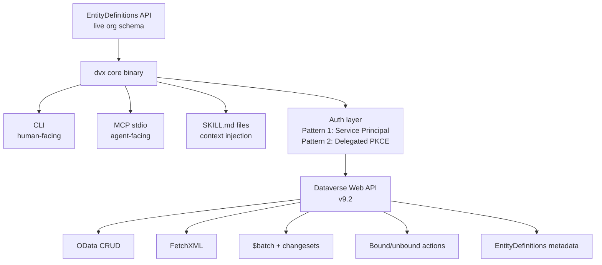

# dvx — Dataverse CLI & MCP Tool for AI Agents

> An agent-first CLI and MCP server for Microsoft Dataverse CE/Sales/Service that uses live org schema as its source of truth, exposing capabilities no existing tool provides: on-demand entity discovery, FetchXML, batch operations, and custom action invocation — all from a single binary.

## Overview

dvx is a developer and agent tool built for the Dynamics 365 / Dataverse ecosystem. It follows the architecture pattern established by Justin Poehnelt's `gws` CLI: one source of truth (the Dataverse `EntityDefinitions` API), multiple surfaces (CLI for humans, MCP stdio for agents, SKILL.md files for context injection).

The primary consumers are AI agents (Claude Code, Cursor, automated pipelines) and D365 consultants/developers. It is explicitly NOT competing with Microsoft's official Dataverse MCP Server for the end-user conversational / Copilot Studio persona — that tool wins in zero-config interactive scenarios. dvx wins everywhere the official server breaks down: queries over 20 rows, FetchXML, batch operations, custom actions, and org-specific schema awareness.

dvx connects directly to the Dataverse Web API via service principal (default) or interactive delegated auth. This means usage is covered by existing D365 licences — no Copilot Credit billing, no Managed Environment requirement.

## Architecture



### Components

**Core Binary (`dvx`)**
- Single compiled binary, TypeScript/Node or Rust (TBD — see open questions)
- Reads schema on-demand from `EntityDefinitions` API, never from baked-in definitions
- All CLI commands map to Web API operations with no intermediate abstraction layer
- Passes raw JSON payloads (`--json`) as primary input path; convenience flags secondary

**Auth Layer**
- Pattern 1 (default): Service principal via client credentials flow (`/.default` scope)
  - App registration + application user in Dataverse + security roles
  - `dvx auth create --service-principal` — stores credentials in env vars or local config
- Pattern 2 (interactive): Delegated PKCE, `az login` style
  - `dvx auth login` — browser pop, token cached with refresh
  - Use when audit trail under named identity required AND official MCP server can't run the query
- `CallerObjectId` header support on Pattern 1 for per-user security enforcement without interactive login

**Schema Discovery Layer**
- `dvx schema <entity>` — fetches `EntityDefinitions(LogicalName='<entity>')` with full `AttributeDefinitions` expanded, returns as machine-readable JSON
- `dvx entities` — returns entity names + display names only (no schemas), fast index
- Schema responses are field-masked to only return what agents need: `LogicalName`, `DisplayName`, `AttributeType`, `RequiredLevel`, `IsCustomAttribute`, `OptionSet` (for picklists)
- Short-lived local cache (TTL 5 min) for repeat queries in same session; `--no-cache` flag to force live fetch

**Query Engine**
- `dvx query --odata '<expression>'` — OData passthrough with full paging via `@odata.nextLink`
- `dvx query --fetchxml '<xml>'` — FetchXML passthrough, handles paging cookie
- `dvx query --file <path>` — read query from file (supports both OData and FetchXML based on content)
- `--fields <comma-separated>` — field mask applied to all queries
- `--page-all` — stream all pages as NDJSON (one record per line)
- `--max-rows <n>` — safety cap, default 5000
- `--output json|ndjson|table` — output format

**Record Operations**
- `dvx get <entity> <id>` — single record by GUID with optional `--fields`
- `dvx create <entity> --json '<payload>'`
- `dvx update <entity> <id> --json '<payload>'`
- `dvx upsert <entity> --match-field <field> --json '<payload>'` — GET then CREATE or UPDATE
- `dvx delete <entity> <id>`
- `dvx batch --file <operations.json>` — execute `$batch` with optional `--atomic` (changeset wrapping)

**Action Executor**
- `dvx action <ActionName> --json '<payload>'` — unbound action
- `dvx action <ActionName> --entity <entity> --id <guid> --json '<payload>'` — bound action
- Handles standard CRM SDK messages: `WinOpportunity`, `Merge`, `RouteCaseToQueue` etc.

**MCP Surface**
- `dvx mcp` — starts MCP stdio server
- `--entities <comma-separated>` — scope tool list to specific entities (reduces context load)
- Tool list dynamically built from EntityDefinitions for scoped entities
- Meta-tools always available regardless of scope:
  - `discover_entity(entity_name)` — fetch entity schema on demand
  - `list_entities()` — entity names only
  - `execute_query(odata|fetchxml)` — raw query passthrough
  - `execute_action(name, payload, entity?, id?)` — action executor
  - `batch_execute(operations[])` — batch wrapper
- Entity-specific tools generated from schema: `create_<entity>`, `update_<entity>`, `get_<entity>`, `query_<entity>`

**SKILL.md Files**
- Domain-scoped, not entity-scoped
- Loaded on demand by the agent, not injected at startup
- Each encodes org-agnostic guidance agents can't derive from schema alone

## Tech Stack

| Layer | Choice | Notes |
|---|---|---|
| Runtime | TypeScript / Node.js | [TBD — see open questions re: Rust] |
| Package manager | pnpm | Monorepo-ready |
| MCP SDK | `@modelcontextprotocol/sdk` | stdio transport |
| Auth | `@azure/msal-node` | Both client credentials and PKCE flows |
| HTTP client | `node-fetch` or native `fetch` | With retry + backoff |
| CLI framework | `commander` or `yargs` | [TBD] |
| Output | NDJSON streaming + JSON + table (via `cli-table3`) | |
| Config | `.dvx/config.json` per-project, env var override | |
| Build | `tsup` or `esbuild` | Single binary output |
| Distribution | npm global install + standalone binary via `pkg` or `bun compile` | |

## Data Models

### Auth Profile
```typescript
interface AuthProfile {
  name: string
  type: 'service-principal' | 'delegated'
  environmentUrl: string       // https://org.crm.dynamics.com
  tenantId: string
  clientId: string
  // service-principal only:
  clientSecret?: string        // stored in OS keychain, not config file
  // delegated only:
  cachedTokenPath?: string
}
```

### Entity Schema Cache Entry
```typescript
interface EntitySchemaCacheEntry {
  logicalName: string
  displayName: string
  entitySetName: string
  primaryIdAttribute: string
  primaryNameAttribute: string
  attributes: AttributeDefinition[]
  cachedAt: Date
  ttlMs: number
}

interface AttributeDefinition {
  logicalName: string
  displayName: string
  attributeType: string          // String, Integer, Lookup, Picklist, etc.
  requiredLevel: 'None' | 'SystemRequired' | 'ApplicationRequired' | 'Recommended'
  isCustomAttribute: boolean
  maxLength?: number
  optionSet?: OptionSetDefinition
  targets?: string[]             // for Lookup types — target entity names
}
```

### Batch Operation
```typescript
interface BatchOperation {
  method: 'GET' | 'POST' | 'PATCH' | 'DELETE'
  path: string                   // relative to /api/data/v9.2/
  headers?: Record<string, string>
  body?: unknown
  contentId?: string             // for cross-referencing in changesets
}

interface BatchRequest {
  operations: BatchOperation[]
  atomic: boolean                // wrap in changeset if true
}
```

### MCP Tool Definition (generated)
```typescript
interface GeneratedMcpTool {
  name: string                   // e.g. "create_opportunity"
  description: string
  inputSchema: JSONSchema         // derived from AttributeDefinitions
  handler: (args: unknown) => Promise<unknown>
}
```

## API Design

### CLI Commands

```
dvx auth create [--service-principal] [--name <profile>]
dvx auth login [--name <profile>]
dvx auth list
dvx auth select <profile>

dvx entities [--output json|table]
dvx schema <entity> [--output json] [--no-cache]

dvx query --odata '<expr>' [--fields <f1,f2>] [--page-all] [--max-rows <n>] [--output json|ndjson|table]
dvx query --fetchxml '<xml>' [--page-all] [--max-rows <n>]
dvx query --file <path>

dvx get <entity> <id> [--fields <f1,f2>]
dvx create <entity> --json '<payload>'
dvx update <entity> <id> --json '<payload>'
dvx upsert <entity> --match-field <field> --json '<payload>'
dvx delete <entity> <id> [--confirm]

dvx action <name> [--entity <entity>] [--id <guid>] [--json '<payload>']

dvx batch --file <path> [--atomic] [--dry-run]

dvx mcp [--entities <e1,e2>] [--port <n>]
```

### Dataverse Web API Endpoints Used

| Operation | Endpoint |
|---|---|
| Entity list | `GET /api/data/v9.2/EntityDefinitions?$select=LogicalName,DisplayName,EntitySetName,PrimaryIdAttribute,PrimaryNameAttribute` |
| Entity schema | `GET /api/data/v9.2/EntityDefinitions(LogicalName='<name>')?$expand=Attributes` |
| OData query | `GET /api/data/v9.2/<entitySetName>?<odata>` |
| FetchXML | `GET /api/data/v9.2/<entitySetName>?fetchXml=<encoded>` |
| Create | `POST /api/data/v9.2/<entitySetName>` |
| Update | `PATCH /api/data/v9.2/<entitySetName>(<id>)` |
| Upsert | `PATCH /api/data/v9.2/<entitySetName>(<id>)` + `If-None-Match: *` header |
| Delete | `DELETE /api/data/v9.2/<entitySetName>(<id>)` |
| Unbound action | `POST /api/data/v9.2/<ActionName>` |
| Bound action | `POST /api/data/v9.2/<entitySetName>(<id>)/Microsoft.Dynamics.CRM.<ActionName>` |
| Batch | `POST /api/data/v9.2/$batch` |

### Auth Token Acquisition

**Service Principal:**
```
POST https://login.microsoftonline.com/<tenantId>/oauth2/v2.0/token
scope: <environmentUrl>/.default
grant_type: client_credentials
```

**Delegated (PKCE):**
```
scope: <environmentUrl>/user_impersonation
grant_type: authorization_code
```

## Business Logic

### Schema Discovery — Field Mask Strategy
Never return full `AttributeDefinitions` expansion by default — it's enormous. Apply `$select` on the expand:
```
$expand=Attributes($select=LogicalName,DisplayName,AttributeType,RequiredLevel,IsCustomAttribute,MaxLength,Targets)
```
For picklist attributes, make a secondary call to get option set values only when the agent requests full schema for that specific attribute.

### Input Hardening (from Justin's article, applied to Dataverse context)
- Reject `?`, `#`, `%` in entity names and GUIDs (agent hallucination: embedding query params in IDs)
- Validate GUIDs against UUID v4 format before sending
- Sanitise FetchXML through a parser before sending (prevent injection via malformed XML)
- `--dry-run` on all mutating operations: validate request shape locally, print what would be sent, do not execute

### Paging Strategy
- OData: follow `@odata.nextLink` automatically when `--page-all` is set
- FetchXML: extract and re-encode `@Microsoft.Dynamics.CRM.fetchxmlpagingcookie` between pages
- Stream pages as NDJSON immediately rather than buffering — agents can process incrementally
- Enforce `--max-rows` cap across all pages to prevent runaway queries

### Batch Size Limits
- Dataverse `$batch` hard limit: 1000 operations per batch request
- dvx default: 100 operations per changeset (configurable)
- Auto-chunk large batch files into multiple requests with progress output

### CallerObjectId Impersonation
When `--as-user <entra-object-id>` flag is passed on any mutating operation:
- Requires Pattern 1 (service principal) auth
- Requires service principal to have `prvActOnBehalfOfAnotherUser` privilege
- Adds `CallerObjectId: <guid>` header to request
- Effective privileges = intersection of service principal privileges and impersonated user privileges

## Integration Points

### Dataverse Web API
- Version: v9.2 (latest stable)
- Auth: OAuth 2.0 via Entra ID
- Rate limits: Service protection limits apply (300 requests/60s per server, per user)
  - dvx implements exponential backoff on 429 responses
  - Respects `Retry-After` header

### Entra ID (Azure AD)
- Token acquisition via MSAL Node
- Service principal: client credentials flow
- Delegated: auth code + PKCE, tokens cached in OS keychain or local file

### MCP Protocol
- Transport: stdio (primary), HTTP/SSE (future)
- Protocol version: current stable MCP spec
- Tool registration: dynamic, from EntityDefinitions at server startup
- Meta-tools: always registered regardless of `--entities` scope

## SKILL.md Files

Shipped with dvx, domain-scoped:

```
skills/
├── dvx-sales/SKILL.md           # Opportunity lifecycle, stage transitions, quota
├── dvx-service/SKILL.md         # Case management, SLA fields, queue routing
├── dvx-field-service/SKILL.md   # Work orders, scheduling, resource bookings
├── dvx-schema/SKILL.md          # How to discover and use schema, FetchXML patterns
├── dvx-batch/SKILL.md           # Batch operation patterns, changeset usage
├── dvx-auth/SKILL.md            # Auth setup, service principal creation
└── dvx-dataverse-gotchas/SKILL.md  # Plugin opacity, restricted tables, virtual tables
```

Each SKILL.md includes:
- When to load this skill
- Entity names and logical names relevant to this domain
- Common FetchXML patterns for this domain
- Known gotchas (e.g. status reason transition constraints, restricted tables, plugin side effects)
- Field names agents commonly hallucinate

## Non-Functional Requirements

**Performance**
- Schema fetch for a single entity: <500ms on warm connection
- `dvx entities` (list only): <200ms
- Streaming NDJSON should begin within 1s of first page response
- Local schema cache TTL: 5 min default, configurable

**Security**
- Client secrets never written to config files — stored in OS keychain (keytar) or passed via env var
- No logging of token values or secrets
- `--dry-run` flag on all mutating operations
- `--confirm` required for destructive operations (delete) in interactive mode

**Context Window Discipline**
- `dvx schema` output is field-masked — never dumps full EDMX
- `dvx entities` returns names only, not schemas
- MCP tool descriptions are concise (<100 chars)
- NDJSON paging means agents never need to buffer full result sets

**Compatibility**
- Node.js 18+
- Windows (WSL2 + native), macOS, Linux
- Works with any MCP client: Claude Code, Cursor, Windsurf, VS Code GitHub Copilot
- Dataverse Web API v9.2 (compatible with all D365 CE/Sales/Service/Field Service environments)

## Implementation Phases

### Phase 1: Auth + Schema Discovery + Basic Query
**Deliverables:**
- `dvx auth create --service-principal` — stores profile, validates connection
- `dvx entities` — returns entity name list from EntityDefinitions
- `dvx schema <entity>` — returns field-masked entity schema as JSON
- `dvx query --odata '<expr>'` — OData passthrough, single page
- `dvx query --odata '<expr>' --page-all` — full paging, NDJSON output
- `dvx get <entity> <id>` — single record fetch
- Output formats: JSON and table
- Local schema cache (in-memory, session-scoped for Phase 1)

**Dependencies:** Entra ID app registration, application user in target org

### Phase 2: Mutations + FetchXML + Batch
**Deliverables:**
- `dvx create`, `dvx update`, `dvx upsert`, `dvx delete`
- `dvx query --fetchxml '<xml>'` with paging cookie handling
- `dvx batch --file <path>` with `--atomic` changeset support
- `--dry-run` on all mutating operations
- `--confirm` on delete
- Input validation (GUID format, entity name sanitisation)
- Retry logic with exponential backoff on 429

**Dependencies:** Phase 1

### Phase 3: Actions + MCP Surface
**Deliverables:**
- `dvx action <name>` — unbound and bound action executor
- `dvx mcp` — MCP stdio server with meta-tools
- `--entities` scoping for MCP tool list
- Dynamic tool generation from EntityDefinitions for scoped entities
- SKILL.md files for core domains (sales, service, schema, gotchas)

**Dependencies:** Phase 2

### Phase 4: Delegated Auth + CallerObjectId + Persistent Cache
**Deliverables:**
- `dvx auth login` — PKCE flow, token cached in OS keychain
- `--as-user <entra-object-id>` impersonation on mutating operations
- Persistent schema cache (SQLite, TTL-managed) replacing in-memory cache
- `dvx schema --refresh` to force cache invalidation
- SKILL.md files for remaining domains (field service, batch, auth)

**Dependencies:** Phase 3

### Phase 5: Distribution + DX Polish
**Deliverables:**
- npm global install (`npm i -g dvx`)
- Standalone binary via `bun compile` or `pkg` (no Node.js required)
- `dvx init` wizard — guided app registration + application user setup
- Shell completion (bash, zsh, PowerShell)
- `--output json` on all commands for machine-readable output

**Dependencies:** Phase 4

## Open Questions

- [ ] **Language choice:** TypeScript/Node vs Rust. Node is faster to ship and the MCP SDK is first-class. Rust produces a true standalone binary with better performance. Given the Velrada context and existing TypeScript expertise, Node is recommended for Phase 1-3 with a potential Rust rewrite of the hot path later.
- [ ] **Binary name:** `dvx` is clean and available on npm (verify). Alternatives: `dvcli`, `d365x`, `ppx`.
- [ ] **Multi-environment support:** Should a single `dvx mcp` session be able to switch environments mid-session, or is it one env per process? Recommendation: one env per process, use separate MCP server instances for multi-env workflows.
- [ ] **Virtual table handling:** Dataverse virtual tables backed by F&O have their own query constraints. Should dvx detect virtual tables and apply different query strategies? Flag as [TBD] for Phase 2.
- [ ] **Restricted tables:** Some tables require specific D365 licences. Should dvx detect and warn? How?
- [ ] **Solution-scoping:** The `mwhesse/dataverse-mcp` tool persists solution context (publisher prefix, solution name). Should dvx support this for development workflows? Likely Phase 4+.
- [ ] **HTTP vs stdio transport for MCP:** stdio is universal. HTTP/SSE enables remote deployment (e.g. OpenClaw). Phase 3 = stdio only, Phase 5 = add HTTP/SSE.
- [ ] **Velrada branding:** Open source (GitHub, npm public) vs Velrada-internal tool vs commercial product? Affects licensing, distribution, and whether SKILL.md files encode proprietary methodology.
